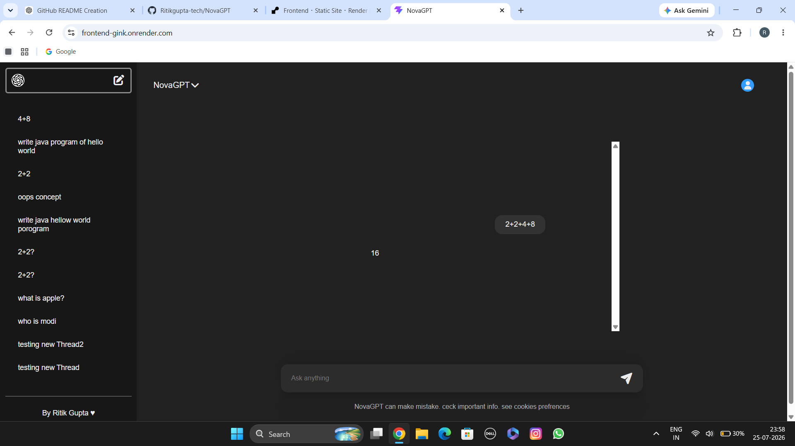
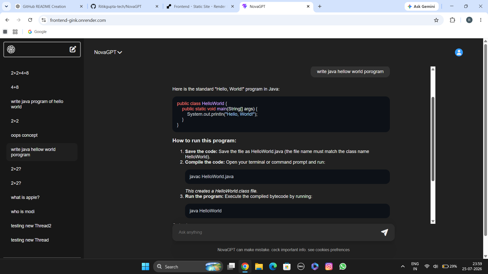
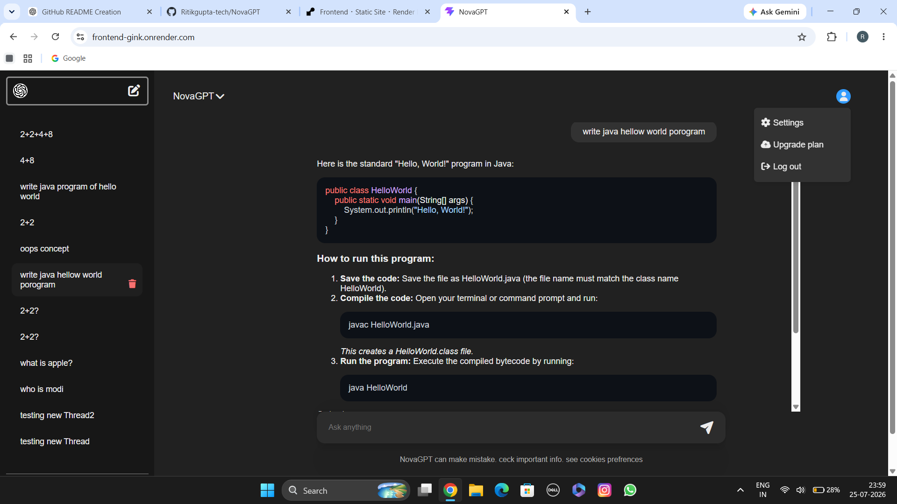

<div align="center">

# 🚀 NovaGPT

### AI-Powered Full Stack Chat Application

Built with React, Node.js, Express, MongoDB, and Google Gemini API.

<p>


</p>

</div>

---

## 📌 About The Project

NovaGPT is a modern AI-powered chatbot application that allows users to have intelligent conversations with an AI assistant while managing multiple chat threads with persistent storage.

The application offers a clean and responsive UI, Markdown support, syntax-highlighted code blocks, and seamless AI integration using the Google Gemini API.

---

## ✨ Key Features

- AI-Powered Chat Assistant
- Persistent Conversation History
- Multiple Chat Threads
- Real-Time Responses
- Markdown Rendering Support
- Syntax Highlighted Code Blocks
- Responsive UI Design
- MongoDB Database Integration
- RESTful API Architecture
- Render Deployment Ready

---

## 🛠️ Tech Stack

| Frontend | Backend | Database | AI |
|---------|---------|---------|---------|
| React.js | Node.js | MongoDB | Google Gemini API |
| Vite | Express.js | Mongoose | Gemini Models |
| CSS3 | CORS | | |

---

## 📁 Project Structure

```bash
NovaGPT
│
├── Backend
│   ├── models
│   ├── routes
│   ├── utils
│   ├── server.js
│   └── package.json
│
├── Frontend
│   ├── src
│   ├── public
│   ├── package.json
│   └── vite.config.js
│
└── README.md
```

---

## 📸 Screenshots

### Home Page



---

### Chat Window



---

### Thread Management


---

## 🚀 Live Demo

| Service | Link |
|--------|--------|
| Frontend | https://frontend-gink.onrender.com |
| Backend API | https://novagpt-agwb.onrender.com |

---

## ⚙️ Installation

### Clone Repository

```bash
git clone https://github.com/Ritikgupta-tech/NovaGPT.git
```

```bash
cd NovaGPT
```

---

## Backend Setup

```bash
cd Backend
npm install
```

Create .env file:

```env
MONGODB_URI=YOUR_MONGODB_URI

GEMINI_API_KEY=YOUR_GEMINI_API_KEY
```

Run the server:

```bash
npm run dev
```

or

```bash
npm start
```

Runs on:

```bash
http://localhost:8080
```

---

## Frontend Setup

```bash
cd Frontend
npm install
```

Create .env file:

```env
VITE_API_URL=http://localhost:8080
```

Run:

```bash
npm run dev
```

Runs on:

```bash
http://localhost:5173
```

---

## API Endpoints

| Method | Endpoint | Description |
|------|------|------|
| POST | /api/chat | Generate AI Response |
| GET | /api/thread | Fetch All Threads |
| GET | /api/thread/:threadId | Fetch Single Thread |
| DELETE | /api/thread/:threadId | Delete Thread |

---

## Deployment

### Backend (Render)

```
Root Directory : Backend

Build Command:
npm install

Start Command:
npm start
```

Environment Variables:

```env
MONGODB_URI=
GEMINI_API_KEY=
```

---

### Frontend (Render)

```
Root Directory : Frontend

Build Command:
npm install && npm run build

Publish Directory:
dist
```

Environment Variables:

```env
VITE_API_URL=
```

---

## Future Enhancements

- User Authentication
- Dark Mode
- Voice Assistant
- Streaming Responses
- Multiple AI Models
- Image Generation
- Chat Sharing
- Export Chats

---

## Learning Outcomes

This project demonstrates:

- Full Stack Development
- REST API Development
- React Context API
- MongoDB Integration
- Gemini API Integration
- Environment Variables
- Markdown Rendering
- Production Deployment
- Error Handling
- Modern Project Architecture

---

## Author

### Ritik Gupta

- B.Tech CSE
- Full Stack Developer
- MERN Stack Enthusiast
- Java Developer

GitHub:

```text
https://github.com/Ritikgupta-tech
```

---

<div align="center">

### ⭐ If you like this project, don't forget to star the repository!

</div>